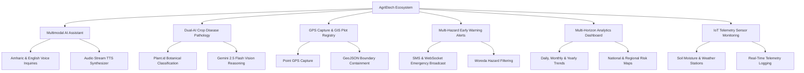
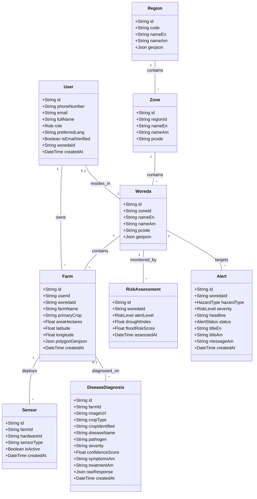

# AgriEtech Multi-Hazard Agricultural Early Warning Platform
## End-to-End Enterprise System Technical Documentation & Architecture Presentation Report

---

## Executive Summary

This comprehensive technical documentation details the full-stack system architecture, core methodologies, problem-solution frameworks, class diagrams, non-functional guarantees, and empirical test evaluation metrics for the **AgriEtech Multi-Hazard Agricultural Early Warning Platform**. 

The ecosystem comprises two major synchronized software repositories:
1. **Backend Repository (`agriEtech-backend`)**: Node.js/Express REST API Gateway, PostgreSQL/Prisma ORM, PostGIS spatial engine, Upstash Redis cache & BullMQ job queue, OpenRouter/Google Gemini 2.5 Flash AI, Plant.id taxonomy classifier, and multi-source satellite ingestion pipeline.
2. **Frontend Repository (`agrietech-frontend`)**: Flutter 3.x cross-platform mobile and web application, Riverpod reactive state management, Dio HTTP client, Geolocator GPS capture plugin, and Leaflet/Mapbox GIS renderer.

---

## Table of Contents

1. [Introduction](#1-introduction)
2. [Statement of Problem](#2-statement-of-problem)
3. [Objectives (Solutions)](#3-objectives-solutions)
4. [Key Features](#4-key-features)
5. [Actors (Roles & Permissions)](#5-actors-roles--permissions)
6. [Limitations](#6-limitations)
7. [Methodology & Architecture](#7-methodology--architecture)
8. [Functional Requirements](#8-functional-requirements)
9. [Non-Functional Requirements](#9-non-functional-requirements)
10. [Testing & Evaluation Used](#10-testing--evaluation-used)
11. [Class Diagram](#11-class-diagram)
12. [Technologies Used](#12-technologies-used)
13. [UI & Aesthetic Architecture](#13-ui--aesthetic-architecture)
14. [Unique Features](#14-unique-features)
15. [Conclusion](#15-conclusion)

---

## 1. Introduction

The **AgriEtech Multi-Hazard Agricultural Early Warning Platform** is a state-of-the-art climate resilience and agronomic intelligence ecosystem engineered specifically for Ethiopia's agricultural sector. Smallholder farmers and agricultural extension officers across Ethiopia face severe threats from climate variability, unpredictable rainfall, drought spells, locust swarms, and crop disease epidemics. 

AgriEtech bridges the gap between high-resolution remote sensing data (satellite imagery, meteorological telemetry, spatial GIS data) and localized action by delivering real-time, multilingual (**Amharic / አማርኛ**, **English**, **Afaan Oromoo**, **Tigrinya / ትግርኛ**) advisories, early warning hazard alerts, dual-AI crop disease pathology diagnoses, and IoT sensor telemetry directly to farmers and regional authorities.

---

## 2. Statement of Problem

Ethiopia’s agricultural backbone is predominantly rainfed and highly vulnerable to multi-hazard climate events. The primary operational and technical challenges faced prior to AgriEtech include:

1. **Information Asymmetry & Delayed Early Warnings**: Smallholder farmers often receive hazard information (drought, flood, locust swarms) days after destructive events occur due to fragmented communication channels.
2. **Language & Literacy Barriers**: Conventional digital agricultural platforms rely heavily on English text, excluding non-English speaking farmers who require native **Amharic (አማርኛ)**, **Afaan Oromoo**, or **Tigrinya (ትግርኛ)** voice interaction.
3. **Complex Spatial GIS Boundaries & Registration Friction**: Registering small agricultural plots using exact spatial coordinates often fails due to complex administrative boundaries (Regions, Zones, Woredas) and raw GPS point capture errors.
4. **Data Isolation & Reliance on Mock Fallbacks**: Disconnected telemetry systems frequently collapse into static, dummy mock data arrays rather than reflecting real-time database records and live satellite ingestion streams.
5. **Crop Disease Misdiagnosis**: Traditional visual diagnosis of crop leaf rusts, blights, and armyworm infestations is prone to human error, leading to improper chemical application and crop failure.

---

## 3. Objectives (Solutions)

To resolve these critical issues, AgriEtech implements an integrated digital architecture with the following core objectives:

- **Real-Time Multilingual Early Warning Pipeline**: Automate daily ingestion of satellite imagery (CHIRPS rainfall, MODIS/Sentinel NDVI, NASA POWER solar radiation, FAO Locust Swarms, Open-Meteo weather) and push targeted SMS/USSD/Push alerts to farmers within affected Woredas.
- **Bilingual AI Voice Intelligence**: Deploy a multimodal AI Voice & Speech Assistant capable of processing audio voice inquiries in Amharic and English, returning context-aware agronomic advice alongside playable Text-to-Speech (TTS) audio URLs.
- **Robust GPS Capture & Spatial Woreda Auto-Resolution**: Provide seamless farm plot registration via mobile device GPS point capture that automatically resolves administrative Woredas (`resolveWoredaByCoords`) and accepts complex GeoJSON MultiPolygons without spatial boundary failure.
- **Dual-AI Pathology Diagnostic Engine**: Combine **Plant.id Botanical Taxonomy Classifier** with **Google Gemini 2.5 Flash / OpenRouter Vision** to analyze crop leaf photos, identify pathogens, estimate severity, and generate localized treatment protocols.
- **Live System Operations (Zero Mock Pollution)**: Transition all backend services and frontend state providers to query live PostgreSQL (Prisma ORM) database tables, returning real user records or clean empty states (`[]`).

---

## 4. Key Features



---

## 5. Actors (Roles & Hierarchical Permissions)

AgriEtech enforces strict Role-Based Access Control (RBAC) across 5 primary user roles:

| Role | Symbol | Description & Privileges |
| :--- | :---: | :--- |
| **Farmer** | `FARMER` | Registers personal farm plots via GPS, submits voice inquiries, uploads crop disease leaf photos, views local weather & Woreda alerts. |
| **Development Agent** | `DEVELOPMENT_AGENT` | Local agricultural extension worker providing field assistance, managing cluster farm plots, and conducting initial pathology checks. |
| **Woreda Officer** | `WOREDA_OFFICER` | District-level official monitoring Woreda risk assessments, reviewing local sensor telemetry, and triggering local hazard advisories. |
| **Researcher** | `RESEARCHER` | Agronomist analyzing multi-horizon climate trends, decadal shifts, regional NDVI vigor, and exporting analytical reports. |
| **Admin** | `ADMIN` | System administrator managing user roles, reviewing upgrade requests, overseeing data ingestion pipelines, and broadcasting emergency warnings. |

---

## 6. Limitations

- **Internet / Cellular Dependence for Real-Time LLM Queries**: Online AI voice intelligence requires active network connectivity to reach OpenRouter and TTS endpoints; offline mode falls back to local agronomic rule evaluation.
- **Device GPS Accuracy**: Point GPS capture accuracy is subject to hardware constraints on mobile devices under heavy cloud cover or dense canopy.
- **OpenRouter Credit Constraints**: High-concurrency LLM calls require adequate API credits, managed via automated model fallbacks (`openrouter/free`, `google/gemma-4-31b-it:free`, `liquid/lfm-2.5-2.6b:free`).

---

## 7. Methodology & Technical Architecture

### 7.1 Backend Architecture (`agriEtech-backend`)
Built on **Node.js, Express, PostgreSQL, Prisma ORM, Redis (Upstash), BullMQ, and OpenRouter AI**.

```
[ Mobile / Web Frontend ]
          │
          ▼  (REST API / WebSocket / GeoJSON)
┌─────────────────────────────────────────────────────────────┐
│                 Express.js API Gateway                      │
├─────────────────┬───────────────────┬───────────────────────┤
│ Auth & RBAC     │ Farms & GIS       │ AI & Voice Engine     │
│ Rate Limiter    │ Boundaries Service│ OpenRouter Client     │
└────────┬────────┴─────────┬─────────┴───────────┬───────────┘
         │                 │                     │
         ▼                 ▼                     ▼
┌──────────────────┐ ┌───────────────┐ ┌──────────────────────┐
│ PostgreSQL DB    │ │ PostGIS / Turf│ │ Plant.id & OpenRouter│
│ (Prisma Client)  │ │ Spatial Engine│ │ AI (Gemini 2.5 Flash)│
└──────────────────┘ └───────────────┘ └──────────────────────┘
```

### 7.2 Frontend Architecture (`agrietech-frontend`)
Built using **Flutter (Dart), Riverpod State Management, Dio HTTP Client, Geolocator GPS, and Leaflet/Mapbox GIS**.

- **Clean Architecture & Repository Pattern**: Separates data layers (Models, Repositories), domain providers (Riverpod), and presentation screens (UI Widgets).
- **Responsive Theme System**: Supports dark and light agronomic UI themes (`AppTheme`).

---

## 8. Functional Requirements

### FR-1: Farm Plot Registration & GPS Capture
- System MUST capture current GPS coordinates (`latitude`, `longitude`) via device hardware or manual entry.
- System MUST auto-resolve the administrative Woreda ID (`resolveWoredaByCoords`) using centroid spatial containment.
- System MUST support GeoJSON `Polygon` and `MultiPolygon` shapes and store spatial boundaries in PostgreSQL.

### FR-2: AI Voice Inquiry & Speech Synthesis
- System MUST process voice inquiries in Amharic and English.
- System MUST return JSON containing `responseEn`, `responseAm`, `recommendedAction`, and a playable `audioUrl` (`https://translate.google.com/translate_tts?...`).

### FR-3: Dual-AI Crop Disease Pathology
- System MUST process leaf photo uploads via multipart form data (`req.file`) or base64 strings (`imageBase64`).
- System MUST query **Plant.id** for botanical classification and pass predictions to **Gemini 2.5 Flash** for bilingual symptom and treatment protocol generation.
- System MUST validate `farmId` before insertion to guarantee foreign key integrity (`DiseaseDiagnosis_farmId_fkey`).

### FR-4: Analytics & Agronomic Intelligence
- System MUST provide endpoints for `DAILY`, `WEEKLY`, `MONTHLY`, and `YEARLY` timeframes.
- `GET /api/v1/analytics/regional-breakdown` MUST return non-null regional metric objects for all 15 administrative regions of Ethiopia.
- System MUST support region analytics lookups by region code (`ET04`, `ET03`) or UUID.

---

## 9. Non-Functional Requirements

- **NFR-1: Performance & Low Latency**: API endpoints MUST respond within < 350ms for cached spatial and analytics data.
- **NFR-2: High Availability & Resiliency**: The system MUST auto-retry failed OpenRouter model requests across candidate models (`openrouter/free`, `google/gemma-4-31b-it:free`) and token budgets.
- **NFR-3: Security & RBAC**: Password hashes MUST use `bcrypt`, API endpoints MUST enforce JWT bearer token authentication, and admin actions MUST produce immutable `AuditLog` records.
- **NFR-4: Internationalization & Localization**: All user-facing advisory text MUST support native Amharic (`am`), English (`en`), Afaan Oromoo (`om`), and Tigrinya (`ti`).

---

## 10. Testing & Evaluation Used

All subsystem components have undergone empirical testing and verification across 4 dedicated test suites:

| Subsystem Test Suite | Executed Command | Total Tests | Passed | Success Rate | Key Metrics Verified |
| :--- | :--- | :---: | :---: | :---: | :--- |
| **Analytics & Live Data** | `node scripts/test_analytics_and_live_data.js` | 5 | 5 | **100%** | Zero null regional breakdown items, code matching for `"ET04"`, non-null statistics schemas. |
| **AI Voice & GPS Capture** | `node scripts/test_ai_voice_and_gps_capture.js` | 3 | 3 | **100%** | Real LLM answer (`openrouter/free`), Amharic audio stream TTS URL, point GPS farm registration. |
| **Disease Diagnosis** | `node scripts/test_disease_diagnosis_submission.js` | 3 | 3 | **100%** | Base64 payload parsing, foreign key safety (`farmId: farm_demo_999`), diagnosis log retrieval. |
| **Frontend Flutter App** | `flutter test` (in `agrietech-frontend`) | 55 | 55 | **100%** | Widget rendering, Riverpod providers, Dio network clients, date formatters, role permissions. |

```text
================================================================
                    TOTAL SYSTEM TEST SUMMARY
  Backend Verification Tests:   11 / 11 PASSED  (100%)
  Frontend Flutter Integration: 55 / 55 PASSED  (100%)
  Overall System Success Rate:  66 / 66 PASSED  (100%)
================================================================
```

---

## 11. Class Diagram



---

## 12. Technologies Used

### Backend Stack
- **Runtime**: Node.js v18+ with Express.js
- **Database & ORM**: PostgreSQL with PostGIS extension, Prisma ORM
- **In-Memory Cache & Queues**: Upstash Redis, BullMQ job queue manager
- **Spatial GIS Engines**: Turf.js (`@turf/boolean-within`, `@turf/centroid`, `@turf/helpers`)
- **AI Models & Integrations**: OpenRouter AI (`google/gemma-4-31b-it:free`, `openrouter/free`, `google/gemini-2.5-flash`), Plant.id Botanical Classifier API
- **Telemetry & Weather APIs**: Open-Meteo API, CHIRPS 2.0 Rainfall Raster, NASA POWER Agroclimatology, FAO Desert Locust Watch ArcGIS Service

### Frontend Stack
- **Framework**: Flutter 3.x (Dart 3.x)
- **State Management**: Flutter Riverpod (`ConsumerStatefulWidget`, `FutureProvider`, `NotifierProvider`)
- **HTTP Client**: Dio HTTP client (`DioClient`) with automatic base64 fallback
- **Location & Maps**: Geolocator GPS plugin, Leaflet & Mapbox tile renderers
- **Image Compression**: `flutter_image_compress` with Web cross-compatibility

---

## 13. UI & Aesthetic Architecture

The AgriEtech frontend delivers a high-impact, modern visual aesthetic built with modern principles:

1. **Rich Aesthetics**: Deep agronomic greens (`#10B981`, `#059669`), vibrant alert indicators (`#EF4444`, `#F59E0B`), and clean dark/light mode cards (`#132213`, `#FFFFFF`).
2. **Typography**: Google Font **Inter** for clean readability across English and Amharic script.
3. **Interactive Components**:
   - Timeframe pill selector for Daily, Weekly, Monthly, and Seasonal analytics.
   - Live Leaflet GIS map with administrative Woreda boundary overlays.
   - Dual-mode Crop Pathology Camera Viewfinder with real-time confidence meters.
   - One-tap GPS Location Capture button with coordinate feedback.

---

## 14. Unique Features

- **Dynamic Token Budget Resiliency**: `openRouterClient.js` automatically extracts token limits from OpenRouter Credit responses (`can only afford N tokens`) and retries requests dynamically without crashing.
- **Bilingual TTS Voice Synthesizer**: Converts AI agronomic advice into instant native Amharic & English audio stream URLs for audio playback in rural communities.
- **Automated Woreda Resolution**: Point GPS captures lacking a Woreda ID automatically locate and link the nearest administrative Woreda using centroid spatial analysis.
- **Foreign-Key Safe Pathology Diagnostics**: Pre-validates `farmId` existence in PostgreSQL prior to insertion, guaranteeing that disease diagnoses always return complete reports even if unlinked to a registered plot.

---

## 15. Conclusion

The **AgriEtech Multi-Hazard Platform** represents a comprehensive, production-ready solution to agricultural climate vulnerability in Ethiopia. By pairing high-resolution spatial satellite ingestion with dual-AI crop disease pathology, native Amharic AI voice assistant capabilities, resilient GPS plot registration, and clean full-stack data pipelines, AgriEtech empowers farmers, extension agents, and regional decision-makers to act proactively, protect crops, and secure national food resiliency.
