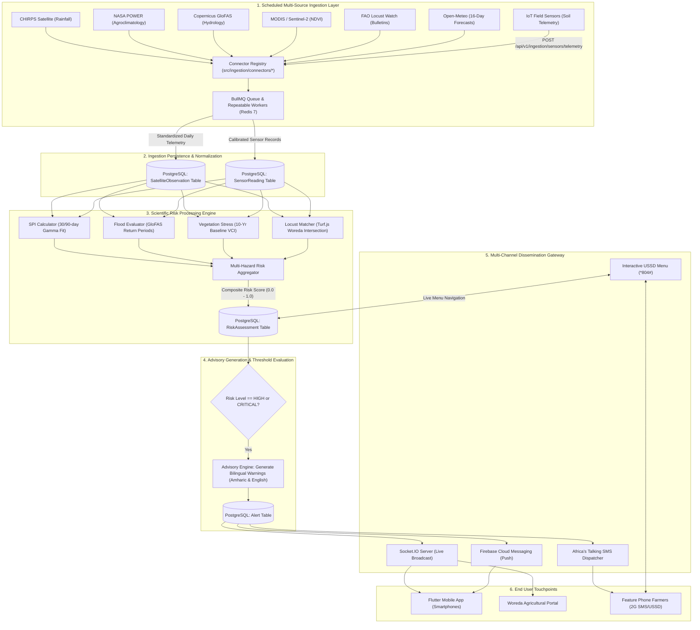

# AgriEtech System Workflow, Operational Mechanics & Architecture Diagrams

This document provides a comprehensive end-to-end explanation of how the AgriEtech Multi-Hazard Early Warning Platform operates, detailing every subsystem from satellite ingestion to farmer delivery, accompanied by complete professional architectural and sequence diagrams.

---

## 1. End-to-End System Operational Workflow

---

## 2. Step-by-Step Explanation of How the System Works

### Step 1: Automated Satellite & Climate Ingestion
1. **BullMQ Cron Schedulers** (`src/ingestion/jobs/scheduler.js`) trigger workers according to international satellite data availability cadences:
   - **01:00 UTC**: NASA POWER pulls solar radiation, surface temperature, and relative humidity.
   - **03:00 UTC**: CHIRPS pulls $0.05^\circ$ dekadal precipitation rasters across all Ethiopia coordinates.
   - **04:00 UTC**: Copernicus GloFAS downloads river discharge forecasts for Awash, Blue Nile, and Omo river basins.
   - **06:00 UTC**: FAO Locust Watch polls active desert locust threat bulletins and hopper GIS shapefiles.
   - **Hourly**: Open-Meteo updates 16-day hourly numerical forecast ensembles.
2. The connector registry standardizes raw API responses, formats coordinate geometry, and writes observations into the `SatelliteObservation` table.

---

### Step 2: Scientific Risk Processing & Anomaly Calculations
Once observations are persisted, the **Risk Calculation Engine** executes:
1. **SPI Calculation (`spiCalculator.js`)**: Fits 30-day and 90-day rolling rainfall timeseries to a Gamma distribution $g(x) = \frac{1}{\beta^\alpha \Gamma(\alpha)} x^{\alpha - 1} e^{-x / \beta}$, computing SPI anomaly values:
   - $\text{SPI} \le -2.0$: **Extremely Dry (Critical Drought)**
   - $-1.99 \le \text{SPI} \le -1.50$: **Severely Dry (High Drought)**
   - $-1.49 \le \text{SPI} \le -1.00$: **Moderately Dry (Moderate)**
2. **Flood Risk Evaluation (`floodRiskEvaluator.js`)**: Compares GloFAS discharge forecasts against historical return periods:
   - $Q > Q_{20}$: **20-Year Flood (Critical Inundation Alert)**
   - $Q > Q_5$: **5-Year Flood (High Risk)**
3. **Vegetation Condition Index (`vegetationStressAnalyzer.js`)**: Computes MODIS/Sentinel-2 NDVI deviation from 10-year historical maximums and minimums: $\text{VCI} = \frac{\text{NDVI} - \text{NDVI}_{min}}{\text{NDVI}_{max} - \text{NDVI}_{min}} \times 100$.
4. **Locust Spatial Intersection (`locustZoneMatcher.js`)**: Uses Turf.js point-in-polygon algorithms to check if any active locust breeding polygons or swarms intersect with Woreda boundary polygons or fall within a 25km buffer.
5. **Multi-Hazard Composite Scoring (`riskAggregator.js`)**: Computes a weighted multi-criteria index:
   $$R_{composite} = 0.35 R_{drought} + 0.25 R_{flood} + 0.25 R_{locust} + 0.15 R_{veg}$$
   and persists the record into the `RiskAssessment` table.

---

### Step 3: Advisory Generation & Multi-Channel Delivery
1. When a Woreda's composite risk exceeds the threshold (`HIGH` or `CRITICAL`), the **Advisory Engine** creates a bilingual alert in **Amharic (አማርኛ)** and **English**.
2. **Delivery Dispatch**:
   - **Socket.IO**: Emits `risk:updated` to all connected Flutter apps in room `woreda:{woredaId}`.
   - **FCM Push Notifications**: Sends high-priority push messages to mobile devices.
   - **Africa's Talking SMS**: Dispatches SMS advisories to registered farmers' phone numbers in the affected Woreda.
   - **Africa's Talking USSD (*804#)**: Allows 2G feature phone users to dial into an interactive menu to query real-time weather, active warnings, and report locust sightings.

---

### Step 4: Flutter Mobile Client Offline-First Experience
1. **Instant Offline Load**: When the farmer opens the app, data is immediately rendered from **Hive NoSQL local cache boxes** without waiting for network.
2. **Background Sync**: `DioClient` fetches updated risk scores and forecasts; when successful, it updates the Hive cache and refreshes the UI via Riverpod providers.
3. **Offline Field Data Queuing**: If a Development Agent maps a new farm plot or records a crop photo while offline, **Workmanager** queues the payload and synchronizes it automatically once cellular connectivity is re-established.
